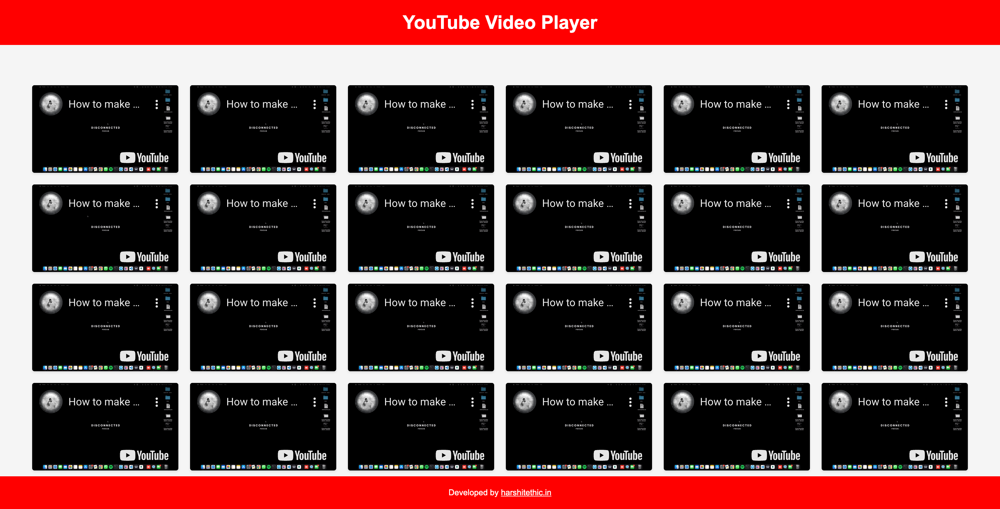

# YouTube Video Player

About Me:
- Name: Harshit Sharma
- GitHub: [harshitethic](https://github.com/harshitethic)
- Instagram: [harshitethic](https://www.instagram.com/harshitethic/)

## Description

This project is a YouTube video player that allows you to play multiple videos simultaneously. It is built using HTML, CSS, and JavaScript. The player uses the YouTube Player API to embed and control the videos.

## Features

- Play multiple YouTube videos simultaneously.
- Customize the number of times each video plays and loops.
- Automatic playback of videos.
- Videos are muted by default.
- Simple and user-friendly interface.
- Responsive design for different screen sizes.

## Installation

To use the YouTube Video Player, follow these steps:

1. Clone the repository or download the code.
2. Open the `index.html` file in a web browser.

## Usage

1. Open the YouTube Video Player in your web browser.
2. Fill in the YouTube URL, number of plays, and number of loops for the video you want to play.
3. Click the "Play" button.
4. The specified number of video players will be displayed on the screen, playing the video simultaneously.

## Screenshots

## Author

This project is developed by Harshit Sharma. You can find more about me and my projects on my website [harshitethic.in](https://harshitethic.in).

## License

This project is licensed under the [MIT License](LICENSE).
